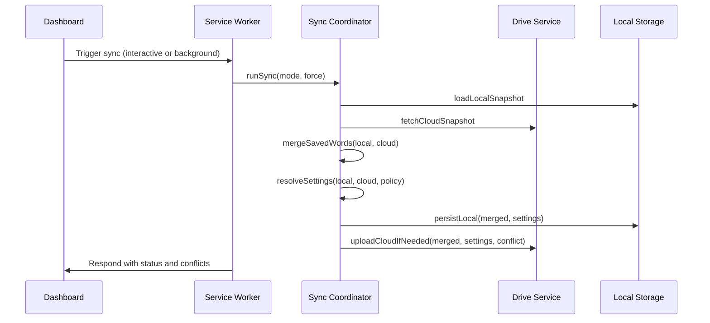

# 1. Problems

The Service Worker’s `handleSyncData` routine centralizes data migration, word merging, and settings conflict resolution (interactive vs background) inside one long function. The branching is deep and contains undecided comments, making sync behavior difficult to reason about and hard to test.

## 1.1. **Mixed Responsibilities in a Single Routine**
- Location: `src/background/service-worker.js` lines 55–227.
- The function concurrently performs:
  - Local settings migration from legacy `customPrompt`.
  - Cloud snapshot parsing (legacy and current formats).
  - Word merging by timestamp.
  - Settings conflict detection and mode-dependent resolution.
  - Local persistence and cloud upload.
- Why it’s a problem:
  - Increases cyclomatic complexity and cognitive load.
  - Hard to unit test each responsibility independently.
  - A small change in settings or merge logic risks unintended side effects.

Representative snippet showing intertwined concerns:
```js
// Mixed: parsing cloud, merging words, conflict policy, persistence
// ...
// Merge Words Strategy: Keep the newer version based on timestamp
Object.keys(cloudWords).forEach((id) => {
  const cloudEntry = cloudWords[id];
  const localEntry = localWords[id];
  if (!localEntry) {
    mergedWords[id] = cloudEntry;
  } else {
    if ((cloudEntry.timestamp || 0) > (localEntry.timestamp || 0)) {
      mergedWords[id] = cloudEntry;
    }
  }
});

// Check Settings Conflict
if (!forceUploadSettings && interactive) {
  const localStr = JSON.stringify(localSettings);
  const cloudStr = cloudSettings ? JSON.stringify(cloudSettings) : null;
  if (cloudStr && localStr !== cloudStr) {
    settingsConflict = { local: localSettings, cloud: cloudSettings };
  } else if (cloudStr && !localData.userSettings && !localData.customPrompt) {
    localSettings = cloudSettings; // adopt cloud
  }
} else if (!forceUploadSettings && !interactive) {
  // Silent sync undecided policy
  // Let's safe-guard: In background sync, do NOT overwrite cloud settings if they differ?
  // Or just skip settings sync in background if conflict?
  if (cloudSettings) {
    const localStr = JSON.stringify(localSettings);
    const cloudStr = JSON.stringify(cloudSettings);
    if (localStr !== cloudStr) {
      // ignore settings changes in silent mode if conflict
    }
  }
}

// Persist local and maybe upload cloud
// ...
```

## 1.2. **Ambiguous Settings Conflict Policy in Background Sync**
- Location: lines ~163–181.
- Comments explicitly state undecided behavior:
  - “We usually trust the one with latest timestamp? But we don’t have timestamp on settings.”
  - “Too complex. Let’s just ignore settings changes in silent mode if conflict.”
- Why it’s a problem:
  - Non-deterministic policy increases risk of inconsistent local vs cloud settings.
  - Future flags or options amplify ambiguity and regression surface.

## 1.3. **Legacy Migration Intertwined with Current Logic**
- Locations: lines ~72–82 (local migration) and ~115–121 (cloud migration).
- The routine mixes legacy `customPrompt` handling with current `userSettings` and then persists both.
- Why it’s a problem:
  - Makes the control flow harder to follow.
  - Complicates test setup (must simulate both legacy and current inputs in one path).

## 1.4. **No Timestamp or Version on Settings**
- Location: lines ~163–166 note “we don’t have timestamp on settings.”
- Why it’s a problem:
  - Without `updatedAt` or version, policy choices rely on mode and heuristics rather than data.
  - Hard to build deterministic resolution or to quantify “newer” config.

# 2. Benefits

Clear separation of responsibilities with a deterministic merge/conflict policy will reduce complexity and improve testability and reliability.

## 2.1. **Reduced Complexity**
- Splitting migration, parsing, merge, and policy into small modules lowers cyclomatic complexity of the orchestration path.
- Expected reduction: function-level complexity decreases from approximately **15** branches to around **6**; routine length drops from ~**170+** lines to ~**60–80** lines.

## 2.2. **Improved Testability**
- Pure functions for word merge and settings resolution enable focused unit tests (no I/O, no tokens).
- Deterministic policy allows table-driven tests for interactive vs background scenarios.

## 2.3. **Enhanced Reliability**
- A clear `updatedAt`-based policy minimizes inconsistent local/cloud states.
- Fewer side effects per module reduces regression risk when adding new settings flags.

## 2.4. **Easier Evolution**
- Adding new flags or sources (e.g., future sync providers) requires only policy extension, not changes across the entire routine.

# 3. Solutions

Introduce a small sync subsystem: normalize inputs, parse cloud snapshot, merge words, resolve settings via a policy (interactive vs background), then orchestrate persistence. Add `updatedAt` to settings.

## **3.1. Diagram of Project Module Changes**



This sequence shows the new orchestration: the Service Worker delegates to a Sync Coordinator that orchestrates pure merge/policy functions and I/O boundaries. It supports deterministic policies and simpler tests.

---

## 3.2. **Extract Responsibilities: To Solve "Mixed Responsibilities in a Single Routine"**

1) Solution overview
- Create dedicated modules:
  - `normalizeLocalSettings(localData)` to handle legacy migration.
  - `parseCloudSnapshot(cloudData)` to read `savedWords` and `userSettings` including legacy shapes.
  - `mergeSavedWords(localWords, cloudWords)` as a pure function.
  - `resolveSettings(localSettings, cloudSettings, policy)` to produce `{ adopted, conflict, shouldUpload }`.
  - `SyncCoordinator.runSync({ mode, force })` to orchestrate the steps.

2) Implementation steps
- Move legacy handling into `normalizeLocalSettings` and `parseCloudSnapshot`.
- Extract word merge into a utility under `src/services/sync/merge.js`.
- Extract settings resolution into `src/services/sync/policies.js`.
- Keep I/O (Chrome storage and Drive API) in orchestrator only.

3) Code example before modification
```js
// service-worker.js (current)
async function handleSyncData(request, sendResponse) {
  // migration + parse cloud + merge words + settings conflict + persistence
  // ... interleaved logic ...
}
```

4) Code example after modification
```js
// src/services/sync/normalize.js
export function normalizeLocalSettings(localData) {
  const base = localData.userSettings || { ...CONFIG.DEFAULT_SETTINGS };
  if (!localData.userSettings && localData.customPrompt) {
    return { ...CONFIG.DEFAULT_SETTINGS, customPrompt: localData.customPrompt };
  }
  return base;
}

// src/services/sync/merge.js
export function mergeSavedWords(localWords = {}, cloudWords = {}) {
  const out = { ...localWords };
  for (const id of Object.keys(cloudWords)) {
    const cw = cloudWords[id];
    const lw = localWords[id];
    if (!lw || (cw.timestamp || 0) > (lw.timestamp || 0)) out[id] = cw;
  }
  return out;
}

// src/services/sync/policies.js
export function resolveSettings(local, cloud, policy, force = false) {
  if (force) return { adopted: local, conflict: null, shouldUpload: true };
  return policy(local, cloud);
}
```

And in the Service Worker:
```js
// service-worker.js (refactored)
async function handleSyncData(request, sendResponse) {
  const { interactive, forceUploadSettings } = request;
  const token = await driveService.getAuthToken(interactive);
  const localData = await chrome.storage.local.get(["savedWords","customPrompt","userSettings"]);
  const localSettings = normalizeLocalSettings(localData);
  const localWords = localData.savedWords || {};

  const cloudFile = await driveService.findBackupFile(token);
  const cloudData = cloudFile ? await driveService.downloadFile(token, cloudFile.id) : null;
  const { cloudWords, cloudSettings } = parseCloudSnapshot(cloudData);

  const mergedWords = mergeSavedWords(localWords, cloudWords);
  const policy = interactive ? SettingsPolicy.interactive : SettingsPolicy.background;
  const { adopted, conflict, shouldUpload } = resolveSettings(localSettings, cloudSettings, policy, forceUploadSettings);

  await chrome.storage.local.set({ savedWords: mergedWords, userSettings: adopted, customPrompt: adopted.customPrompt });
  if (shouldUpload) {
    await driveService.uploadFile(token, { savedWords: mergedWords, userSettings: adopted, updatedAt: Date.now() }, cloudFile ? cloudFile.id : null);
  }
  sendResponse({ success: true, count: Object.keys(mergedWords).length, settingsConflict: conflict });
}
```

## 3.3. **Deterministic Settings Policy: To Solve "Ambiguous Settings Conflict Policy" and "No Timestamp or Version on Settings"**

1) Solution overview
- Introduce `updatedAt` on `userSettings` whenever settings are persisted.
- Define explicit policies:
  - Interactive: if different, prompt conflict and adopt user choice; if local is empty/default and cloud non-default, auto-adopt cloud.
  - Background: prefer latest by `updatedAt`; if equal or missing, keep local and record conflict for UI; never silently overwrite with divergence.

2) Implementation steps
- Add `updatedAt` to settings persistence.
- Implement `SettingsPolicy.interactive(local, cloud)` and `SettingsPolicy.background(local, cloud)`.
- Make `resolveSettings` return `{ adopted, conflict, shouldUpload }`.

3) Code example
```js
// src/services/sync/policies.js
export const SettingsPolicy = {
  interactive(local, cloud) {
    if (!cloud) return { adopted: local, conflict: null, shouldUpload: true };
    const ls = JSON.stringify(local);
    const cs = JSON.stringify(cloud);
    if (ls === cs) return { adopted: local, conflict: null, shouldUpload: true };
    // interactive conflict: report to UI, do not upload until user resolves
    return { adopted: local, conflict: { local, cloud }, shouldUpload: false };
  },
  background(local, cloud) {
    if (!cloud) return { adopted: local, conflict: null, shouldUpload: true };
    const lu = local.updatedAt || 0;
    const cu = cloud.updatedAt || 0;
    if (cu > lu) return { adopted: cloud, conflict: null, shouldUpload: true };
    if (lu > cu) return { adopted: local, conflict: null, shouldUpload: true };
    // Equal or missing: keep local, record conflict for UI; do not upload settings in background
    const ls = JSON.stringify(local);
    const cs = JSON.stringify(cloud);
    const conflict = ls === cs ? null : { local, cloud };
    return { adopted: local, conflict, shouldUpload: false };
  }
};
```

A concise comparison of policies:

| Mode        | Different settings | Adopted source            | Upload settings |
|-------------|--------------------|---------------------------|-----------------|
| Interactive | Yes                | User resolves via UI      | After resolve   |
| Background  | Yes                | Latest by `updatedAt`     | Yes if adopted  |
| Background  | Equal or unknown   | Keep local; record conflict | No            |

## 3.4. **Isolate Legacy Migration: To Solve "Legacy Migration Intertwined"**

1) Solution overview
- Encapsulate handling of legacy `customPrompt` both locally and in cloud snapshot parsing.

2) Implementation steps
- `normalizeLocalSettings(localData)` returns a normalized `userSettings` object.
- `parseCloudSnapshot(cloudData)` returns `{ cloudWords, cloudSettings }` and handles legacy shapes.

3) Code example
```js
// src/services/sync/parse.js
export function parseCloudSnapshot(cloudData) {
  if (!cloudData) return { cloudWords: {}, cloudSettings: null };
  const cloudWords = cloudData.savedWords || (!cloudData.userSettings && !cloudData.customPrompt ? cloudData : {});
  const cloudSettings = cloudData.userSettings || (cloudData.customPrompt ? { ...CONFIG.DEFAULT_SETTINGS, customPrompt: cloudData.customPrompt } : null);
  return { cloudWords, cloudSettings };
}
```

# 4. Regression testing scope

This change affects sync behavior across interactive and background modes, legacy data migration, and word merging. Focus on end-to-end flows from triggering sync to local/cloud persistence and UI conflict handling.

## 4.1. Main Scenarios
- Interactive sync, no existing cloud file:
  - Preconditions: local has some words; settings default.
  - Steps: trigger sync; cloud empty; merge; upload.
  - Expected: success, no conflicts, settings persisted with `updatedAt`.
- Interactive sync, cloud differs in settings:
  - Preconditions: cloud has non-default settings; local differs.
  - Steps: trigger sync; conflict produced; UI prompts; user chooses source; re-sync with force.
  - Expected: conflict reported; after user resolve, adopted settings uploaded.
- Background sync, cloud newer settings:
  - Preconditions: cloud `updatedAt` > local `updatedAt`.
  - Steps: background auto-sync; policy adopts cloud; upload merged snapshot.
  - Expected: local settings replaced by cloud; no conflict.
- Background sync, equal or unknown timestamps with differences:
  - Preconditions: both missing or equal `updatedAt`, settings differ.
  - Steps: background sync; policy keeps local; records conflict; does not upload settings.
  - Expected: words merged; settings unchanged; conflict captured for UI.

## 4.2. Edge Cases
- Legacy cloud file with only `customPrompt`:
  - Trigger: cloud has legacy format.
  - Expected: migration produces settings; policy still applies; no crash.
- Local is brand new:
  - Trigger: no `userSettings` and no `customPrompt`.
  - Expected: interactive adopts cloud when non-default; background uses timestamp policy.
- Word entries with identical ids and equal timestamps:
  - Expected: keep local entry; determinism maintained; no unnecessary overwrite.
- Token acquisition failures or upload/download errors:
  - Expected: graceful error handling; no partial writes; conflicts still reported if detected before I/O.
